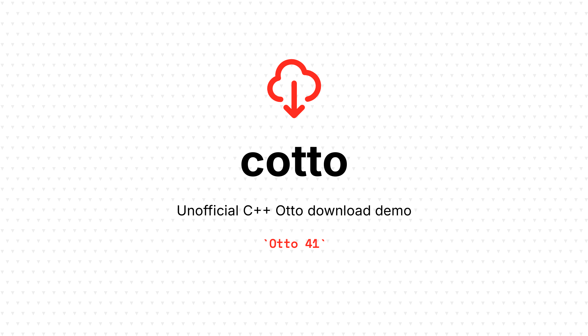

# cotto

> Unofficial C++ Otto download demo

An example of the Otto library implementation in C++.

> [!WARNING]  
> This demo is **not intended for productive usage**.

## Why?

In May 2024, ELSTER introduced a new library called Otto, designed for downloading objects from OTTER (Object Storage in ELSTER). ELSTER took this initiative because the existing solution had reached its limitations. Alongside Otto, a new version of Datenabholung v31 was also released.

The current method of data retrieval using ERiC is planned to be replaced on the client-side with ERiC version 41.2 by November 25th, 2024, at which point only Datenabholung v31 will be available. On the server-side, the transition will occur with the planned annual minimal version increase in mid-April 2025 (exact date to be announced in 2025). After this date, only ERiC version 41.2 or higher with Datenabholung v31 will be supported.

As a result, most software developers currently using ERiC Datenabholung will need to implement Otto in their production systems by April 2025.

This demo intends to simplify the transition and reduce implementation time.

## Usage

```bash
./cotto
  -u objectUuid         UUID of object to download (mandatory)
  -m size               Allocate provided Bytes of memory and download object in-memory (optional, max: 10485760 Bytes), cf. Download modes
  -e extension          Set filename extension of downloaded content [default: "txt"]
  -p password           Password for certificate [default: "123456"]
  -f                    Force file overwriting [default: false]
```

Examples:

```bash
cotto -u 468a69d4-0151-4681-9e8d-fcd87873d550 # ELOProtokoll / Lohnersatzleistung
cotto -u e694eca1-7251-4629-a164-4634db811189 -e pdf # DivaBescheidESt
```

> [!NOTE]  
> The code and scripts have been tested so far only on Linux and macOS.

> [!TIP]  
> A list of object UUIDs is available with test certificates. You can get a list of them using `PostfachAnfrage` with the test certificate. The examples above are for `test-softorg-pse.pfx` and might be removed from the test instance after the time specified in the metadata.

## Vendor

You need the official ELSTER Otto library and header files. Download the ERiC package >= v40 for your platform from the [ELSTER developer area](https://www.elster.de/elsterweb/entwickler/infoseite/eric), unzip it and place it at a desired path. Feel free to place it in `./vendor/`. You need two libraries: `otto` and `eSigner` (platform dependent naming: `(lib)otto.{so|dylib|dll}` and `(lib)eSigner.{so|dylib|dll}`), as well as three header files `otto.h`, `otto_statuscode.h` and `otto_types.h`.

> [!NOTE]  
> The ERiC package, especially the included there libraries are subject to a separate license agreement (presented before download in the ELSTER developer area and included in the ERiC package itself).

> [!TIP]  
> Choose the right library for the platform you compile and run on.

## Compile

You can compile the code with:

```bash
make
```

> [!TIP]  
> Provide `PATH_VENDOR` environment variable to point the path where the ELSTER `otto` library is placed on your system or place the needed libraries in `./vendor/`.

## Run

Follow the steps to run `cotto` locally:

```bash
# Clone repository
git clone git@github.com:rechtlogisch/cotto.git

# Change to directory with source code
cd cotto

# Retrieve test certificate to "certificate" subdirectory
./get-test-certificate.sh

# Compile statically linked to Otto library placed in PATH_VENDOR
PATH_VENDOR="/path/to/otto-library/" make

# Run `cotto`, provide objectUuid with -u option and your DEVELOPER_ID inline
DEVELOPER_ID="00000" ./cotto -u 468a69d4-0151-4681-9e8d-fcd87873d550
```

> [!NOTE]  
> You should set your five-digit Developer-ID (German: Hersteller-ID) as the environment variable `DEVELOPER_ID`. You could source it from for example `.env` or pass it inline to `cotto`, as shown in the steps above.

> [!TIP]  
> The downloaded result will be saved in the same directory as `cotto`, unless you provide a different `PATH_DOWNLOAD`.

## Environment variables

All supported environment variables are listed in [`.env.example`](.env.example). Feel free to copy them to `.env`, adjust accordingly and source for usage.

## Download modes

The demo showcases two methods for downloading objects: blockwise (default) and in-memory. Otter and Otto operate by design by streaming data and forwarding it to the desired storage blockwise. That is the optimal and memory-efficient way for large files. ELSTER engineers wrapped all the necessary calls and the download workflow in one function: `OttoDatenAbholen()`, which simplifies the implementation and temporarily stores the complete object in memory.

This demo can operate in both modes. To download in-memory, add the option `-m` with a value exceeding `0` and not exceeding `10485760` Bytes (10 MiB). It is recommended to use the in-memory mode with objects where the final size is known and does not exceed the arbitrarily set size of 10485760 Bytes.

> [!IMPORTANT]  
> `-m` sets the minimal allocated memory size. When the object is larger than the set size, Otto allocates as much as needed and as much as available memory. Use at your own risk.

## Docker

A simple [Dockerfile](Dockerfile) is included. You can use `make docker-build` and `make docker-cotto` to build and run `cotto` in a container.

> [!TIP]  
> Mount volumes, set `PATH_DOWNLOAD` and `PATH_LOG` environment variables to expose data outside the container.

## Changelog

Please see [CHANGELOG](CHANGELOG.md) for more information on what has changed recently.

## Contributing

Please see [CONTRIBUTING](https://github.com/rechtlogisch/.github/blob/main/CONTRIBUTING.md) for details.

## Security Vulnerabilities

If you discover any security-related issues, please email open-source@rechtlogisch.de instead of using the issue tracker.

## Credits

- [Krzysztof Tomasz Zembrowski](https://github.com/rechtlogisch)
- [All Contributors](../../contributors)

## License

The MIT License (MIT). Please see [License File](LICENSE.md) for more information.

The ERiC package, especially libraries, is not included in this repository and is subject to a separate license agreement. Please see the [ELSTER developer area](https://www.elster.de/elsterweb/entwickler/infoseite/eric) or the lizenz.pdf included in the ERiC package for more information.

## Disclaimer

This demo was developed by [RL Recht logisch GmbH & Co. KG](https://rechtlogisch.de/impressum/) and should be used only for test purposes.

ELSTER is a registered trademark of the Freistaat Bayern, represented by the Bayerische Staatsministerium der Finanzen.
